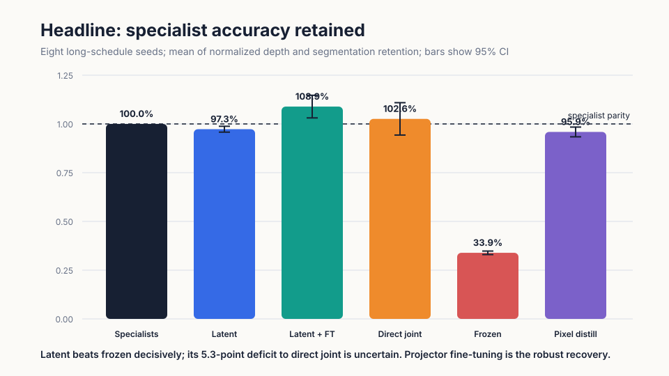
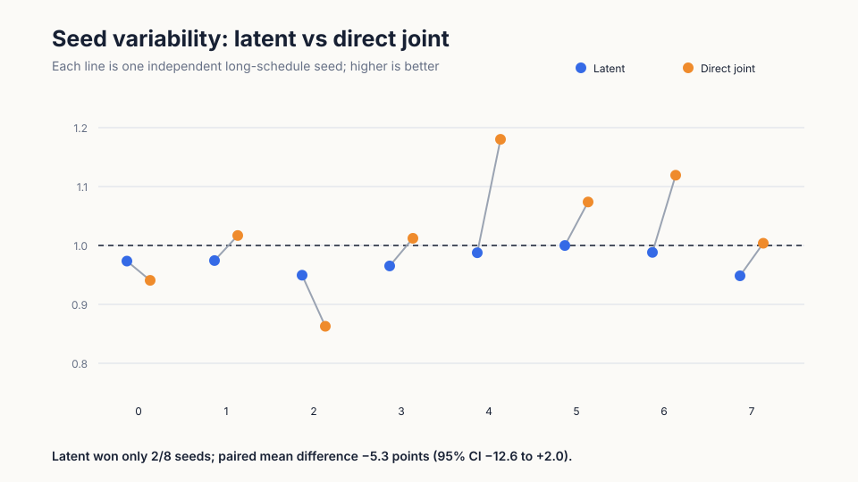
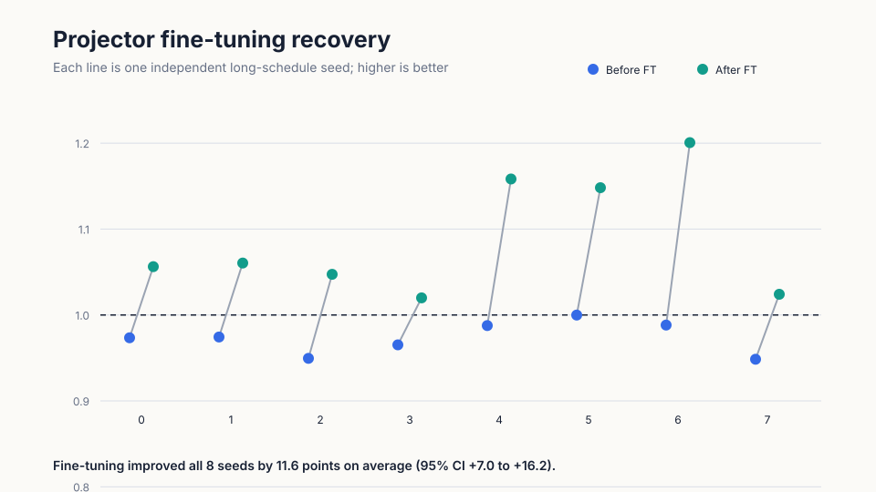
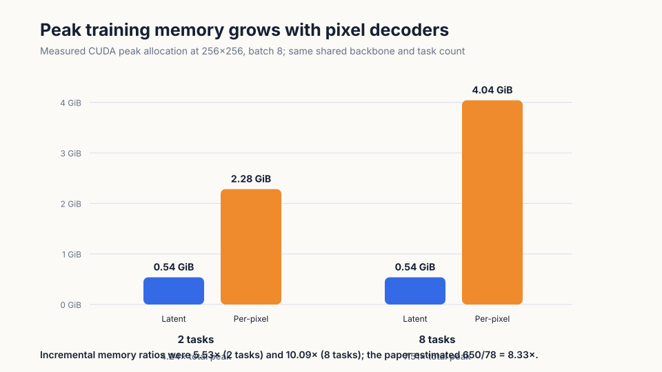
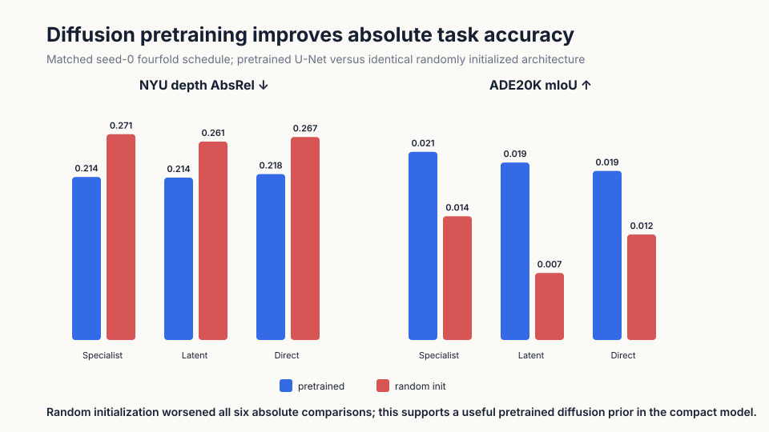

# Compact latent distillation for disjoint dense prediction

Modern vision systems often need several pixel-level answers from one image, such as what each region contains and how far away it is, even though those labels usually come from different datasets. The UniD paper proposes teaching one shared image model from separate specialists by matching their compact internal representations instead of their full-resolution outputs. This reproduction asks whether that compact teaching signal preserves specialist quality and cross-task structure while using less training memory.

## Verdict

**Partially reproduced.** Latent distillation decisively beat a frozen-backbone control and its memory advantage matched the paper’s mechanism, but it did not beat direct joint training in this compact setting. Projector-only fine-tuning reliably recovered and then exceeded specialist accuracy.

Scope: two image tasks, eight long-schedule seeds, NYU Depth V2 and ADE20K subsets, 64×64 inputs, and a 35M-parameter CIFAR-10-pretrained DDPM U-Net. This is not a reproduction of the paper’s eight-task Stable Diffusion video system.

Read the dashed line as specialist parity. Latent distillation retained 97.3% on average and was far above frozen features (33.9%), but direct joint training averaged 102.6%; their paired difference was −5.3 points with a 95% confidence interval from −12.6 to +2.0. The robust result is latent plus projector fine-tuning: 108.9% retention, improving all eight seeds.

## What was reconstructed

Each task first trained its own copy of the pretrained diffusion U-Net and a small pixel head. A new shared U-Net then alternated between disjoint depth and segmentation batches. For latent distillation, a task-specific 1×1 projector matched the corresponding specialist’s 32×32, three-channel U-Net output. Frozen-backbone and direct-joint controls learned from the same labeled batches; the per-pixel control matched the specialists after the 150-class or depth decoder.

Depth used 512/142 examples repartitioned from the public NYU Depth V2 labeled validation set; segmentation used 800 ADE20K training and 200 validation images. The headline schedule used 720 specialist, 1,440 joint/distillation, and 480 fine-tuning steps per seed. The metric averages NYU median-aligned AbsRel retention and ADE20K mIoU retention, each normalized to its matched specialist.

Absolute performance is intentionally far below the paper: it reports 0.059 NYU AbsRel and 0.448 ADE20K mIoU after fine-tuning; this reconstruction measured 0.220 and 0.023. The small backbone, tiny subsets, low resolution, and lack of Stable Diffusion priors explain why this is a mechanism test rather than a benchmark replication.

## Accuracy is seed-sensitive; fine-tuning is not

Latent beat direct joint in only 2/8 seeds. Its 97.3% mean retention had a tighter interval (95.8–98.9%) than direct joint’s 102.6% (94.3–110.9%), but the paired interval includes zero. The first claim is therefore aligned against frozen features and inconclusive-to-divergent against direct joint.

Fine-tuning only the segmentation projector and pixel head improved retention by 11.6 points (95% CI +7.0 to +16.2) and won in every seed. Its mean advantage over direct joint was +6.3 points (95% CI +0.8 to +11.8). This mirrors the paper’s reported ADE20K recovery from 35.7% to 44.8% mIoU, although not its absolute level.

Scaling ADE20K to 3,000 images made latent beat direct (88.0% versus 78.5%), while 5,000 images reversed the result (86.7% versus 92.5%). These checks reinforce that the compact latent/direct ordering is not stable.

## Memory efficiency reproduces

At eight task decoders, latent training peaked at 0.54 GiB allocated versus 4.04 GiB per-pixel: 7.51× lower total peak and 10.09× lower incremental memory. At two tasks the totals were 0.54 and 2.28 GiB. The paper’s 650/78 GiB estimate is an 8.33× ratio, so the measured scaling direction and magnitude align despite radically smaller absolute tensors.

Cross-task consistency used boundary F1 between predicted depth discontinuities and semantic boundaries on ADE20K. Latent scored 0.394 versus pixel’s 0.429; the paired difference was −0.035 with a wide 95% interval (−0.130 to +0.060). Thus the memory reduction did not cause a detectable consistency loss, but neither method was clearly better. This proxy is weaker than the paper’s depth–normal, part–semantic, and albedo–shading tests.

## Does diffusion pretraining matter?

Removing pretrained weights worsened all matched seed-0 absolute comparisons. For example, latent NYU AbsRel rose from 0.214 to 0.261 and ADE20K mIoU fell from 0.0195 to 0.0074. This supports the usefulness of a diffusion prior here, but CIFAR-10 DDPM pretraining is not the paper’s internet-scale Stable Diffusion domain bridge.

## Claim-by-claim assessment

| Claim | Paper | Observed | Assessment |
|---|---|---|---|
| Shared latent model retains specialist accuracy better than controls | Near-specialist task accuracy; frozen DINO inferior | Latent 97.3%, frozen 33.9%, direct 102.6%; latent/direct CI overlaps zero | Aligned vs frozen; not shown vs direct |
| Projector fine-tuning recovers segmentation | ADE20K 35.7→44.8 mIoU | 1.89→2.32 mIoU; +11.6 retention points, 8/8 wins | Mechanism aligned |
| Latent distillation lowers memory | Estimated 650→78 GiB | Measured 4.04→0.54 GiB at eight tasks | Aligned |
| Consistency survives compact distillation | Unified model improves several task pairs | Latent 0.394 vs pixel 0.429; paired CI includes zero | No detectable loss; superiority untested |

## Limits and compute

There was no video, temporal attention, temporal loss, depth–normal pair, or official code. NYU’s labeled validation set was repartitioned, and ADE20K mIoU is extremely low. Conclusions apply only to this documented compact reconstruction.

All evidence ran on Kubernetes using NVIDIA RTX PRO 6000 Blackwell GPUs: four GPUs per experiment, 16 peak concurrent, and 0.52 elapsed wall-clock hours for the compute phase. The exact command was `bash scripts/run_reproduction.sh`. Measurements and exhaustive per-seed values are in [results.csv](results.csv); the [self-contained notebook](notebook.py) opens directly in [Molab](https://molab.marimo.io/github/alphaXiv/unified-video-dense-prediction-from-disjoint-dat/blob/main/reports/compact-unid/notebook.py).

